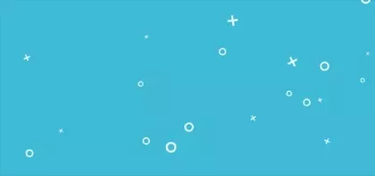

## canvas 实现波浪效果

>[canvas](https://developer.mozilla.org/zh-CN/docs/Web/API/Canvas_API/Tutorial)一直都是前端图像处理领域的一大杀手锏，它的强大之处就在于我们可以通过js绘制出我们想要的任意图像。配合浏览器重绘中暴露的api[requestAnimationFrame](https://developer.mozilla.org/zh-CN/docs/Web/API/Window/requestAnimationFrame)我们可以构建出许多高性能的动画特效。

>关于canvas本人也是十分感兴趣，但要实现出强大的动画特效，光掌握api是仅仅不够的，还需要算法以及一些数学知识储备。

>这里希望能通过剖析一些有趣的动画来了解背后蕴含的算法以及动画原理来循序渐进学习canvas～



[DEMO](https://hq-lin.github.io/cool-skills/canvas-wave/)

讲下这个波浪特效的实现原理：
主要是通过`Math.sin`函数控制图形偏移量倍数在[-1, 1]之间，形成来回波动的效果，而要实现[-1,1]区间来回变化也很简单只需要控制`Math.sin`的变量不断增大，而不断增大的变量我们就可以用时间戳来替代，可以说实现的很巧妙了。

```javascript
// 绘制
function animate() {
    ctx.clearRect(0, 0, Canvas.width, Canvas.height);

    var time = new Date().getTime();
    for (var e in elements) {
        // 将时间戳传入绘制动画当中
        elements[e].draw(ctx, time);
    }
    // 浏览器重绘期间不断绘制新的画布
    window.requestAnimationFrame(animate);
}

// 绘制x形元素
presets.x = function() {
    return {
        // ...
        draw: function() {
            // ...

            // 将时间戳t传入进来不断增加来动态改变x形的偏移，配合Math.sin函数形成一个[-1, 1]的偏移量倍数使得图形上下左右来回绘制
            ctx.translate(this.x + Math.sin((x + (t / 10)) / 100) * 5, this.y + Math.sin((10 + x + (t / 10)) / 100) * 2);
            ctx.rotate(this.r * Math.PI / 180); // 旋转r度

            //  ...
        }
    }
}

// 绘制o形元素
presets.o = function() {
    return {
        // ...
        draw: function() {
            // ...

            // 将时间戳t传入进来不断增加来动态改变o形的偏移，配合Math.sin函数形成一个[-1, 1]的偏移量倍数使得图形上下左右来回绘制
            ctx.arc(this.x + +Math.sin((50 + x + (t / 10)) / 100) * 3, this.y + +Math.sin((45 + x + (t / 10)) / 100) * 4, this.r, 0, 2 * Math.PI, false);

            //  ...
        }
    }
}
```
