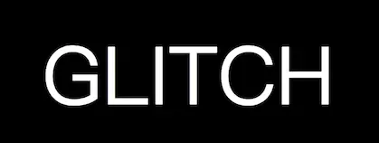

## CSS Glitched Text

> 浏览器实现类抖音文字特效



[DEMO](https://hq-lin.github.io/cool-skills/css-glitched-text/)

讲下原理：首先利用`:before` `:after` 的`content`属性可直接获取到父节点的文本信息，根据定位可以完全与父节点大小、样式以及位置情况保持一致。

这里为了有时差抖动的效果所以要左右偏差1个像素，通过`text-shadow`设置文本描边效果。
```css
.glitch {
    color: white;
    font-size: 100px;
    position: relative;
    width: 400px;
    margin: 0 auto;
}
.glitch:before {
    content: attr(data-text);
    position: absolute;
    left: -1px;
    text-shadow: 1px 0 blue;
    top: 0;
    clip: rect(0, 900px, 0, 0);
    animation: noise-anim-2 3s infinite linear alternate-reverse;
}
.glitch:after {
    content: attr(data-text);
    position: absolute;
    left: 1px;
    text-shadow: -1px 0 red;
    top: 0;
    clip: rect(0, 900px, 0, 0);
    animation: noise-anim 2s infinite linear alternate-reverse;
}
```

精髓就在于`clip`这个属性，`clip: rect(top, right, bottom, left);`

`clip: rect(0, 900px, 0, 0);`可以简单理解成：我将元素浓缩成一个点放置在左上角后向右裁出900px，相当于将这个元素向右展开900px，高度为0

通过sass预处理器可以对css编写函数，将`keyframes`分成20步，也就是每一步5%。随机生成`top`以及`bottom`，`right`一直保持9999px(应该不会有屏幕宽度大于这个值了吧)。

这样的效果就是我不断的对`:before` `:after`进行大小裁切，宽度保持不变，只变了上下裁切区域，而这两个伪类又正好是与父节点大小文字颜色完全一致保持覆盖并有一像素的偏差且带有一像素的文本颜色描边，配合`animation`以及动画的先后顺序就可以产生文字信息抖动的效果。

```scss
@keyframes noise-anim {
    $steps: 20;

    @for $i from 0 through $steps {
        #{percentage($i*(1/$steps))} {
            clip: rect(random(100)+px, 9999px, random(100)+px, 0);
        }
    }
}
```

**不过要注意的一点就是`clip`属性浏览器兼容性很差，建议玩玩就好～**
