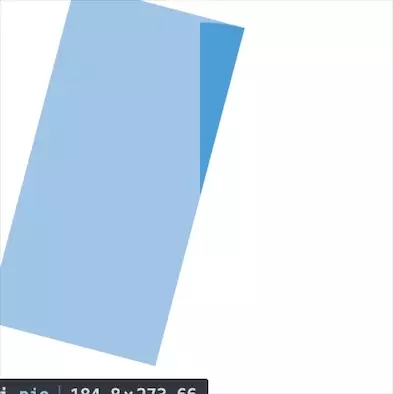

## CSS Pie

> css 实现饼图

揭秘下原理：我们首先需要一个半圆绕自己的圆心做圆周运动，之后需要两个挡板，样式要与半圆保持一致。

半圆一开始是被两个挡板完全遮挡住的，设置好层级关系，左挡板层级最高，右挡板层级最低。

这样当半圆向右转的时候左半部分被左挡板完全遮住并且颜色是白底用户只能看到右边不被遮住的部分，就形成了一个圆弧慢慢展开的效果。当半圆跑到右半边的时候，左挡板透明度瞬间从1置为0，右挡板透明度从0瞬间置为1，由于样式完全与半圆一致用户是感知不到的，并且由于左挡板已经不在了所以半圆在左半边时候转的样式又看的到了。

直接上图演示：

但是光动态出现其实没什么用，这时候我们可以使用`animation-play-state`和`animation-delay`配合来实现一个静态的饼状图。

使用`animation-play-state: paused;`可以将动画暂停，光暂停没什么用我们要的是一个百分比的圆，这时候亮点就在与`animation-delay`我们可以设置为一个负值，
当设置成一个负值的时候我们相当于告诉他一开始的动画是从哪一桢开始，根据`-(animation-delay / animation-duration)`比值可以确定出我们想要的角度。

例如我们要一个四分之一圆可以设置为`animation-delay: -1s;`在实际的运用过程中我们也可以通过js动态计算好数值更改css属性达到想要的图形效果。

### 第二种思路
还有一种玩法是这样的，利用`background: linear-gradient(to right, #ECEFF1 50%, #4CAF50 50%);`将一个圆分为左右两个半圆两种颜色，之后利用`::before`的`rotate`角度来隐藏或者展示某块区域，实现一个饼状图，也算是一种新颖的思路。

其实css实现饼状图的思路还有很多很多，这边列举了两个，之后有发现新的方式还会继续添加进来～
